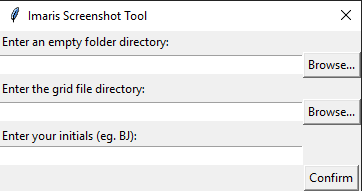
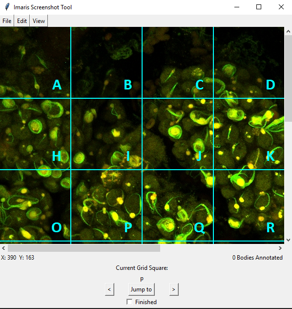

# 1. Table of Contents

- [1. Table of Contents](#1-table-of-contents)
- [2. Biondi Body Morphology Client](#2-biondi-body-morphology-client)
  - [2.1. Installation](#21-installation)
  - [2.2. Usage](#22-usage)
- [3. Support](#3-support)
- [4. Contributing](#4-contributing)
- [5. Authors and Acknowledgements](#5-authors-and-acknowledgements)

# 2. Biondi Body Morphology Client

The Biondi Body Morphology Client is an image screenshotter and annotation software packed into one package. This program is primarily used to categorize the different morphologies of biondi bodies from the epithelium of the choroid plexus.

**Features**
- SQLite database for biondi body information storage
- Screenshotter and image editor
- Clickable markers on the main file
- Sorting features to better view the distribution
- Specialized randomizer algorithm to ensure accuracy

## 2.1. Installation

- Clone the github repository in your local system `git clone https://github.com/whuang37/mlab-imaris-analysis.git`
- Move into the mlab-imaris-analysis repository with `cd biondi_body_client`
- Install all the libraries mentioned in [requirements.txt](https://github.com/whuang37/biondi_body_client/blob/master/requirements.txt) using `pip install -r requirements.txt`
- Run the main python file `python biondi_body_client.py`

## 2.2. Usage
**1)** This is the opening window of the application. **Open Previous Folder** continues editing a previously initiated case while **Initiate Folder** initiates a new case.   

- If this is your first time initiate a folder! When you initiate a folder for the first time you will be met with the following screen. Enter a desired folder to save your images, a gridfile for an overarching reference of biondi body positions, and your initials.   

- Press the **Open Previous Folder** to begin annotating!

**2)** When you open a folder you will be greeted with your grid file and a grid jumper at the bottom. Hit the **forward** and **backward** buttons to move forward or backward in your grid order and jump to them to see that grid. Mark that grid as done with the **finished** checkbox and save it to the checkbox. 

- File options allow you to export your images and open a new case.
- View options allow you to show/unshow the grid, letters, and filter select markers.
  

**3)** Right click on the image to add a marker at the place. In doing so, a popup will show up for you to enter relevant information about the biondi body you are marking. 

**4)** After pressing ok in the popup, a screenshot editor will show up below. Click the brush tool to draw on the image and move around the coordinates with the **top-left** button. Press save to save the annotation and body image.

- A marker on the gridfile will appear allowing you to click on the marker to open up the image in our image viewer.

**5)** The image viewer has a slew of different functions for your use. At the top is a series of filter options to filter select biondi bodies. On the right is a list of biondi bodies. When you click on one, the image of the body and its annotation will load on the right as well as all the information about the body at the bottom. Edit the information, edit the image, or delete the image entirely with the corresponding buttons at the bottom.   

# 3. Support

If you find any bugs please open an issue [here](https://github.com/whuang37/biondi_body_client/issues/new) by including information about the bug and how to reproduce it.

If you'd like to request more functions feel free by opening an issue [here](https://github.com/whuang37/biondi_body_client/issues/new). Please include samples and corresponding results for our review.

# 4. Contributing

We are currently not looking for contributions but if any problems/suggestion arise, open an issue [here](https://github.com/whuang37/biondi_body_client/issues/new) so we can address it accordingly. 

# 5. Authors and Acknowledgements

Development on the Biondi Body Morphology Client by whuang37 and TheSamG.

Thanks to Brett for all his support.

